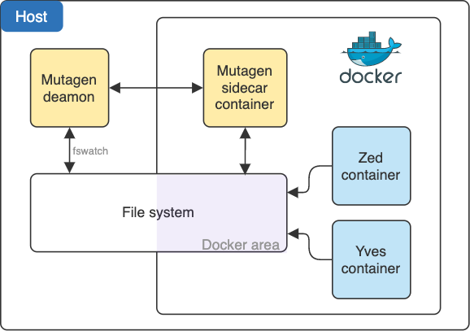

# Choosing a mount mode

This document describes mount modes and how you can choose one.

## Selecting a mount mode for development

Depending on your operating system (OS), choose one of the mount modes in the table.

| Mount mode |        MacOS            | Linux              | Windows (WSL1)          | Windows (WSL2)     |
|--------------|-------------------------|--------------------|-------------------------|--------------------|
| native       | :ballot_box_with_check: | :heavy_check_mark: | :ballot_box_with_check: | :heavy_check_mark: |
| mutagen      | :heavy_check_mark:      |                    |                         |                    |
| docker-sync  | :white_check_mark:      |                    | :heavy_check_mark:      |                    |
☑️
* (:heavy_check_mark:) - recommended solution
* (:white_check_mark:) - supported solution
* (:ballot_box_with_check:) - supported solution with very slow performance

## Supported mount modes

The Docker SDK supports the following mount modes:

* baked
Copies source files into image, so they *cannot* be changed from host machine.
The file or directory is referenced by its absolute path on the host machine.
This mount mode is default for the Demo mode. It is not suitable for the application Development mode.

* native
Mounts source files directly from host machine into containers.
Works perfectly with Linux and Windows (WSL2).

* mutagen
Synchronizes source files between your host machine and a container in an effective real-time way that combines the performance of the rsync algorithm with bidirectionality and low-latency filesystem watching.
This mount mode is stable with MacOS.

* docker-sync
Synchronizes source files from host machine into running containers.
This mount mode is stable with MacOS and Windows (WSL1).


## Changing a mount mode for development

To set a mount mode, in `deploy.dev.yml`, define your OS for the desired mount mode:

```yaml
docker:

...

    mount:
        native:
            platforms:
                - linux

        docker-sync:
            platforms:
                - windows

        mutagen:
            platforms:
                - macos
```

:::(Info) (Multiple mount modes)
If the same OS is defined for multiple mount modes, the first mount mode matching the OS in descending order is selected.
:::

## Configuring a mount mode

To configure a mount mode, see [Configuring a mount mode](07-configuring-a-mount-mode.md).


## Synchronization mount modes

Synchronization mount modes, such as mutagen or docker-sync, use algorithms to synchronize your code between host machine and a docker volume. This allows you to run applications at full speed avoiding file system mount latency.



- Mutagen daemon listens to the host file system changes.
- Mutagen sidecar container listens to the VM file system changes.
- The daemon and the sidecar interact and update files on each side.
- Applications work with the docker volume directly, which is almost equal to a direct file system access.

### What should I keep in mind when using synchronization mount modes?

Keep the following in mind:
* When you change one or more files, it may take several seconds to synchronize them.
* When performing big file operations, like `git checkout` or `composer install`, make sure to wait for synchronization by looking at the synchronization status.
* To check synchronisation session status, use `docker/sdk sync logs`. It works for mutagen and docker-sync.
* When you finish working, make sure to terminate the synchronization session by running `docker/sdk down`.

## See also

* [Manage data in Docker](https://docs.docker.com/storage/)
* [Mutagen documentation](https://mutagen.io/documentation/introduction)
* [Docker-sync documentation](https://docker-sync.readthedocs.io/)
